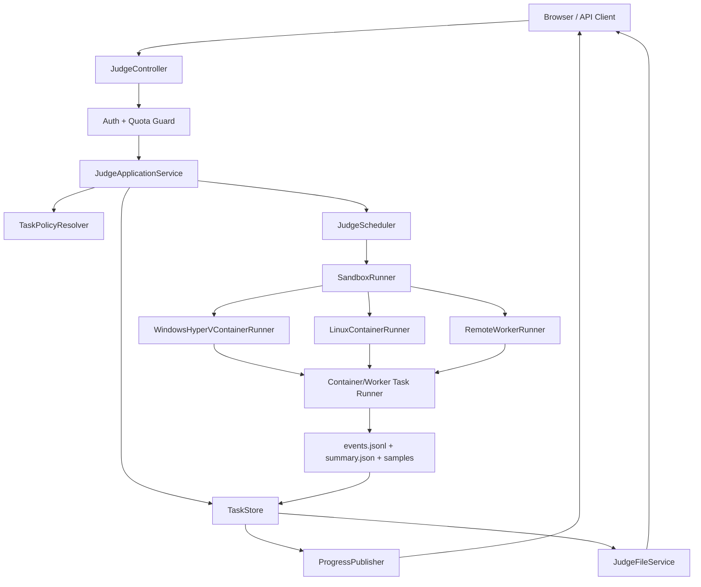

# Design Document

## Overview

本设计把当前 C++ 在线对拍系统升级为跨平台生产沙箱架构。Spring Boot Web 应用继续提供页面、API、鉴权、队列、状态和结果展示；所有用户 C++ 的编译与运行都移动到 `SandboxRunner` 后端。`SandboxRunner` 有多个 provider：Windows Hyper-V 隔离容器、Linux 容器、远程 Worker。业务层只消费统一 task spec、event 和 summary，不直接关心 Windows/Linux 细节。

当前项目已有 `judge-hardening` 规格覆盖本地/内网高容量、队列、摘要和任务存储。本规格在其基础上补齐生产上线需要的强隔离、强认证、平台 provider、Worker 协议、配额、审计和压测验收。

## Steering Document Alignment

### Technical Standards (tech.md)

仓库当前没有正式 `tech.md`。本设计按现有技术栈和生产目标落地：

- Java 17 / Spring Boot 3.5.3
- Thymeleaf + Bootstrap + WebSocket/STOMP
- 文件型 `TaskStore` 作为第一阶段持久化，可后续替换为数据库
- Maven/JUnit/MockMvc 作为主要验证工具
- Windows 使用 Hyper-V isolation container 或 remote worker
- Linux 使用 container + cgroup + namespace + seccomp/AppArmor 或 remote worker

### Project Structure (structure.md)

仓库当前没有正式 `structure.md`。新增代码遵循现有 `com.example.demo` 包结构：

- `config`: sandbox、security、quota、worker 配置和启动校验
- `controller`: 保持现有 judge/auth API，新增管理/health API 时放这里
- `dto`: task spec、event、summary、error response
- `model`: task、user、quota、audit event
- `service`: runner interface、provider、quota、audit、file、progress、cleanup
- `src/test/java/com/example/demo`: 单元、集成、provider capability、stress smoke 测试
- `docs`: 部署 runbook、压测 runbook、安全边界说明

## Code Reuse Analysis

### Existing Components to Leverage

- **`JudgeController`**: 保留 `/judge`、`/judge/start/{judgeId}`、`/judge/status/{judgeId}`、`/details/**`、`/download/**` 的业务语义；新增权限和 structured errors。
- **`JudgeService`**: 保留任务编排入口，但逐步剥离编译、进程、下载、progress 推送和文件读取职责。
- **`TaskPolicyResolver` / `ResolvedTaskPolicy`**: 扩展为生产策略快照，增加 provider、quota、disk/output、retention、full-output 选项。
- **`JudgeScheduler`**: 继续作为全站任务并发和队列控制层；不再把每个 case 都提交到 Java executor。
- **`FileTaskStore`**: 继续写 `metadata.json`、`summary.json`、`events.jsonl`；增加 owner、provider、worker/container id、audit id。
- **`ResultAggregator`**: 继续做小任务完整结果和大任务摘要；接收 runner 事件而非直接接收 Java case future。
- **`SandboxService`**: 现有 Linux firejail/direct 逻辑作为迁移参考，但生产 provider 需要更严格的 capability probe 和 no-downgrade 语义。
- **`AuthenticationInterceptor` / `AccessCodeService`**: 本地模式可暂留；生产模式必须替换或增强为账号体系/外部认证。

### Integration Points

- **HTTP API**: 创建、启动、取消、状态、详情、下载和管理接口。
- **WebSocket**: `/topic/progress/{judgeId}` 使用统一 progress event。
- **Task Store**: `storageBase/judge-{judgeId}` 存源码、配置快照、summary、events 和样本文件。
- **Sandbox Provider**: 本地 Docker/Container runtime、Windows Hyper-V container、Linux container、remote Worker HTTP/gRPC。
- **Audit Sink**: 第一阶段写结构化日志和 events；后续可落数据库。

## Architecture



### Target Flow

1. 用户登录，创建任务。
2. `Auth + Quota Guard` 校验认证、权限、用户配额、全站配额。
3. `TaskPolicyResolver` 生成不可变策略快照。
4. `TaskStore` 创建工作目录并写入源码、metadata、policy。
5. `JudgeScheduler` 按全站并发和队列容量启动任务。
6. `SandboxRunner` 根据 provider 提交任务级 runner。
7. Runner 在沙箱内编译生成器、用户代码、暴力/SPJ，并循环执行 case。
8. Runner 持续写 event/summary/sample 到任务目录，或通过 worker event stream 回传。
9. `ProgressPublisher` 节流推送摘要进度，状态变化立即推送。
10. `JudgeFileService` 只按需读取详情和样本，并校验任务归属。

## Components and Interfaces

### `SandboxProperties`

- **Purpose:** 绑定生产沙箱配置。
- **Location:** `src/main/java/com/example/demo/config/SandboxProperties.java`
- **Fields:**
  - `required: boolean`
  - `provider: direct | windows-hyperv-container | linux-container | remote-worker`
  - `image: String`
  - `isolation: hyperv | process | namespace`
  - `networkDisabled: boolean`
  - `readOnlyRoot: boolean`
  - `runAsNonRoot: boolean`
  - `cpuCount: double`
  - `memoryBytes: long`
  - `pidsLimit: int`
  - `diskBytes: long`
  - `capabilityProbeTimeout: Duration`

### `SandboxRunner`

- **Purpose:** 生产任务执行边界。业务层只依赖该接口。
- **Location:** `src/main/java/com/example/demo/service/sandbox/SandboxRunner.java`
- **Interfaces:**

```java
public interface SandboxRunner {
    SandboxCapabilities probe();
    SandboxRunHandle start(SandboxTaskSpec spec);
    CancelSandboxRunResult cancel(String judgeId);
}
```

- **Rules:**
  - `probe()` 在应用启动和健康检查中都可调用。
  - `start()` 只接收已持久化、已授权、已配额校验的任务。
  - `cancel()` 必须终止容器/worker/job/process tree。

### `SandboxTaskSpec`

- **Purpose:** 传给 runner 的完整任务快照。
- **Location:** `src/main/java/com/example/demo/dto/SandboxTaskSpec.java`
- **Fields:**
  - `judgeId`
  - `userId`
  - `workDir`
  - `generatorSource`
  - `userSource`
  - `oracleSource`
  - `specialJudgeSource`
  - `mode`
  - `testCases`
  - `caseTimeLimit`
  - `taskTimeLimit`
  - `memoryLimitBytes`
  - `outputLimitBytes`
  - `stderrLimitBytes`
  - `diskLimitBytes`
  - `maxProcesses`
  - `retainAllCases`
  - `maxFailureSamples`
  - `maxSlowSamples`

### `SandboxTaskEvent`

- **Purpose:** 统一 runner 事件协议。
- **Location:** `src/main/java/com/example/demo/dto/SandboxTaskEvent.java`
- **Event Types:**
  - `QUEUED`
  - `CONTAINER_STARTING`
  - `COMPILING`
  - `COMPILE_FAILED`
  - `RUNNING`
  - `CASE_SAMPLE`
  - `SUMMARY`
  - `OUTPUT_LIMIT_EXCEEDED`
  - `SECURITY_VIOLATION`
  - `BUDGET_EXCEEDED`
  - `CANCELLED`
  - `COMPLETED`
  - `SYSTEM_ERROR`
  - `SANDBOX_UNAVAILABLE`

### `WindowsHyperVContainerRunner`

- **Purpose:** Windows 生产 provider。
- **Location:** `src/main/java/com/example/demo/service/sandbox/WindowsHyperVContainerRunner.java`
- **Behavior:**
  - 使用 `docker` 或配置的 container CLI 启动 `--isolation=hyperv` 容器。
  - 使用 `--network none` 或等价网络禁用。
  - 仅挂载任务目录。
  - 通过 container runtime 限制内存和 CPU。
  - 容器内 task runner 使用 Job Object 管控编译/运行子进程。
  - `probe()` 必须验证 Hyper-V isolation、禁网和镜像版本。

### `LinuxContainerRunner`

- **Purpose:** Linux 生产 provider。
- **Location:** `src/main/java/com/example/demo/service/sandbox/LinuxContainerRunner.java`
- **Behavior:**
  - 使用 Docker/Podman/containerd CLI 或 adapter。
  - 启用 `--network none`、非 root、只读 rootfs、tmpfs、cgroup memory/cpu/pids、seccomp/AppArmor。
  - 仅挂载任务目录。
  - `probe()` 必须验证 cgroup、非 root、禁网、seccomp/AppArmor 或配置的替代策略。

### `RemoteWorkerRunner`

- **Purpose:** 当 Web 服务不应直接控制容器时，把任务发给独立 Worker VM。
- **Location:** `src/main/java/com/example/demo/service/sandbox/RemoteWorkerRunner.java`
- **Behavior:**
  - 通过 HTTP/gRPC 提交 `SandboxTaskSpec`。
  - Worker 负责平台隔离和执行。
  - Web 层通过 event stream 或轮询读取状态。
  - Worker token、mTLS 或签名请求必须配置。

### `TaskRunner` inside Sandbox

- **Purpose:** 容器/Worker 内部执行程序，负责真实编译和 case 循环。
- **Location:** 可选 `runner/` 子项目或独立目录。
- **Behavior:**
  - 编译所有源码。
  - 对每个 case 运行 generator、user、oracle/SPJ。
  - 记录 event 和 summary。
  - 管控每个子进程的时间、内存、输出、stderr、进程数。
  - Windows 使用 Job Object；Linux 使用进程组/cgroup/runner 内限制，并依赖容器外层限制。

### `QuotaService`

- **Purpose:** 用户和平台资源配额。
- **Location:** `src/main/java/com/example/demo/service/QuotaService.java`
- **Rules:**
  - 每用户并发任务数。
  - 每用户排队任务数。
  - 每日 case 数。
  - 每日 CPU 时间或 task runtime 预算。
  - 全站运行和排队上限。

### `AuditService`

- **Purpose:** 生产审计。
- **Location:** `src/main/java/com/example/demo/service/AuditService.java`
- **Events:**
  - login success/failure
  - task create/start/cancel/download
  - quota reject
  - security violation
  - sandbox unavailable
  - cleanup failure

### `ProductionSecurityStartupValidator`

- **Purpose:** 启动时阻止危险配置。
- **Location:** `src/main/java/com/example/demo/config/ProductionSecurityStartupValidator.java`
- **Rules:**
  - 生产 profile 禁止 default access code。
  - 生产 profile 禁止 wildcard WebSocket origin。
  - 生产 profile 禁止 `direct` runner。
  - 生产 profile 要求 sandbox probe 成功。
  - Windows production 禁止 Job Object-only。
  - Linux production 禁止 ProcessBuilder-only。

## Data Models

### `SandboxCapabilities`

```java
public record SandboxCapabilities(
    String provider,
    String platform,
    boolean available,
    boolean productionSafe,
    boolean networkDisabledVerified,
    boolean nonRootVerified,
    boolean resourceLimitsVerified,
    boolean processTreeKillVerified,
    boolean pathIsolationVerified,
    String isolationMode,
    String imageVersion,
    List<String> warnings,
    List<String> failures
) {}
```

### `SandboxRunHandle`

```java
public record SandboxRunHandle(
    String judgeId,
    String provider,
    String runId,
    String containerId,
    String workerId,
    Instant startedAt
) {}
```

### `JudgeOwnership`

```java
public record JudgeOwnership(
    String judgeId,
    String userId,
    Set<String> roles
) {}
```

### `QuotaSnapshot`

```java
public record QuotaSnapshot(
    String userId,
    int runningTasks,
    int queuedTasks,
    long dailyCasesUsed,
    long dailyCasesLimit,
    Duration dailyRuntimeUsed,
    Duration dailyRuntimeLimit
) {}
```

## Execution Profiles

| Profile | Provider | 用途 | 是否生产安全 | 说明 |
| --- | --- | --- | --- | --- |
| `trusted-local` | `direct` | 单人本机调试 | 否 | 允许方便调试，但必须警告不能上线 |
| `windows-prod` | `windows-hyperv-container` | Windows 生产 | 是 | 必须验证 Hyper-V isolation |
| `linux-prod` | `linux-container` | Linux 生产 | 是 | 必须验证 cgroup/seccomp/非 root/禁网 |
| `worker-prod` | `remote-worker` | Web 与执行分离 | 是 | 推荐用于更强隔离或混合平台 |
| `public-disabled` | none | 禁止公网 | 否 | 保留为拒绝模式 |

## Error Handling

### Error Scenarios

1. **Sandbox provider unavailable**
   - **Handling:** 启动失败或任务创建返回 `SANDBOX_UNAVAILABLE`。
   - **User Impact:** 管理员看到 provider probe 失败原因；普通用户看到“执行环境暂不可用”。

2. **Windows Hyper-V isolation not active**
   - **Handling:** production profile 拒绝启动或拒绝任务。
   - **User Impact:** 管理员看到“当前容器隔离模式不是 hyperv”。

3. **Linux security profile missing**
   - **Handling:** production profile 拒绝任务。
   - **User Impact:** 管理员看到 cgroup/seccomp/AppArmor/非 root 哪一项失败。

4. **Quota exceeded**
   - **Handling:** 创建任务返回 429 或业务错误。
   - **User Impact:** 用户看到剩余配额、重置时间或联系管理员提示。

5. **Task runner crashes**
   - **Handling:** 标记 `SYSTEM_ERROR`，保存 runner stderr 摘要和内部错误码。
   - **User Impact:** 用户看到任务失败，管理员可查 runner 日志。

6. **Security violation**
   - **Handling:** 标记 `SECURITY_VIOLATION`，终止任务，审计记录。
   - **User Impact:** 用户看到“程序触发安全限制”；不展示宿主路径或完整命令。

7. **Output or disk limit exceeded**
   - **Handling:** case 或任务标记 `OUTPUT_LIMIT_EXCEEDED` / `DISK_LIMIT_EXCEEDED`。
   - **User Impact:** 用户看到输出过大或磁盘超限，并可调整程序或联系管理员。

8. **Unauthorized task access**
   - **Handling:** 返回 403，不暴露任务是否存在。
   - **User Impact:** 用户看到无权限访问。

## Testing Strategy

### Unit Testing

- `SandboxPropertiesTest`: 配置绑定和 provider 枚举。
- `ProductionSecurityStartupValidatorTest`: insecure production 配置必须失败。
- `SandboxTaskSpecTest`: task spec 完整性、路径规范化、限制字段。
- `QuotaServiceTest`: 并发、队列、每日 case、runtime 配额。
- `AuditServiceTest`: 关键审计事件字段齐全且脱敏。

### Integration Testing

- `SandboxRunnerContractTest`: 所有 provider 必须通过统一 contract。
- `WindowsHyperVContainerRunnerTest`: 在 Windows + container 可用时执行；否则标记条件跳过并记录原因。
- `LinuxContainerRunnerTest`: 在 Linux + container 可用时执行；否则标记条件跳过并记录原因。
- `RemoteWorkerRunnerTest`: 使用 fake worker 验证提交、事件流、取消、失败。
- `HighVolumeSandboxIntegrationTest`: fake runner 穿过策略、队列、runner、事件、summary、progress，验证 100000 case。
- `AuthorizationIntegrationTest`: 越权详情、下载、取消被拒绝。

### End-to-End Testing

- Windows smoke:
  - `windows-prod` profile 启动。
  - probe 证明 Hyper-V isolation。
  - 100 case AC。
  - 无限输出触发输出限制。
  - fork/process tree 程序被 Job Object kill。
  - 容器退出后无残留。
- Linux smoke:
  - `linux-prod` profile 启动。
  - probe 证明禁网、非 root、cgroup、seccomp/AppArmor。
  - 100 case AC。
  - 网络访问程序失败。
  - fork bomb 被 pids limit 阻断。
  - 输出限制生效。
- High-volume smoke:
  - 10000 case 快速 runner。
  - 100000 case fake/fast runner。
  - 可选 200000 case 压测脚本。
  - 验证 payload size、heap、DOM node、sample count 和 throughput。

## External References

- Microsoft Windows containers: Hyper-V isolation and process isolation.
- Microsoft Windows Job Objects: process tree and resource limits.
- Docker container resource constraints: memory, CPU, pids, network.
- Docker/rootless/seccomp/AppArmor guidance.
- Linux cgroup v2 and container security documentation.

这些参考用于实施时校验平台能力；最终验收以本仓库的 capability tests 和 runbook 为准。
